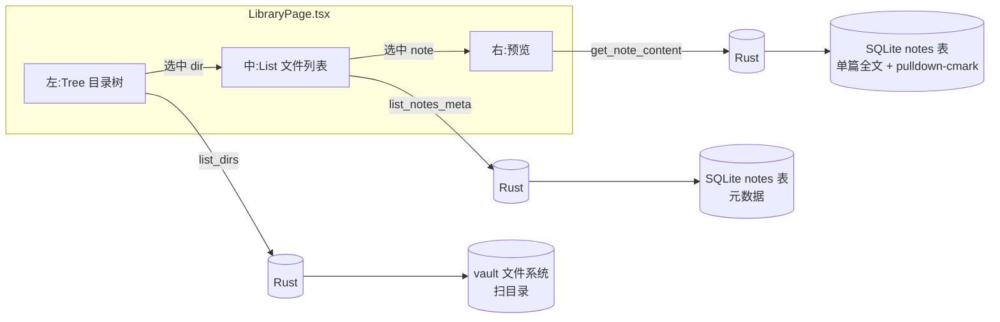

# Design Document · 文档库（Obsidian 式浏览）

## Overview

文档库是 Helmose 的文档浏览出口：**左目录树 + 中文件列表 + 右 markdown 预览**。后端新增三个 Tauri 命令（`list_dirs` / `list_notes_meta` / `get_note_content`），前端新增 `LibraryPage.tsx`，并接入侧边栏菜单与路由。

核心设计取舍：**列表/树只传元数据，单篇才传全文**，以规避 1.9 万文件撑爆 IPC 的性能红线（见 CLAUDE.md）。

## Steering Document Alignment

### Technical Standards (tech.md)
- 遵循 Tauri v2 命令约定（`#[tauri::command]`、`State<'_, Database>`、`Result<T, String>`）。
- IPC 返回值 snake_case，前端 TS 类型对齐。
- markdown 渲染用 Rust `pulldown-cmark`（`features=["html"]`），复用既有依赖、默认安全转义。
- 排除规则与 `index.rs` 保持一致（架构铁律第 5 条）。

### Project Structure (structure.md)
- 命令在 `src-tauri/src/commands/library.rs`，DTO 在 `src-tauri/src/models/note.rs`。
- 前端页面 `frontend/src/pages/LibraryPage.tsx`，类型 `types/index.ts`，封装 `api/index.ts`。
- 注册：`commands/mod.rs` + `main.rs` invoke_handler + `App.tsx` 菜单/路由。

## Code Reuse Analysis

### Existing Components to Leverage
- **`SqliteDatabase`**（`services/database_sqlite.rs`）：`query_map`（返回 Vec）/ `query_row`（返回 Option）/ `execute`，直接复用。
- **`notes` 表**（`services/database.rs` SCHEMA）：索引已写入 `rel_path/file_name/title/note_type/date_iso/tags/raw_content/mtime`，文档库直接查这张表，无需新表。
- **排除规则**（`commands/index.rs::is_excluded` + `EXCLUDE_DIRS`）：`library.rs` 复刻同一逻辑（隐藏目录 + `6-原始资料` + `专家团`），保证视图一致。
- **`vault_root` 辅助**：与 `index.rs` 同款 `query_row` + `ok_or_else`。
- **`pulldown-cmark`**：已在 Cargo.toml（启用 `html` feature），`render_markdown` 用 `Parser::new_ext` + GFM options。

### Integration Points
- **`main.rs::invoke_handler`**：注册三个新命令。
- **`App.tsx`**：菜单加「文档库」（`FolderOpenOutlined`，置顶），路由加 `/library`。
- **`useVaultStore`**：`LibraryPage` 经 selector 取 `vault`，复用现有 store。

## Architecture

三栏 UI，数据按需懒加载：



### Modular Design Principles
- **单文件职责**：`library.rs` 三个命令 + `render_markdown`；`LibraryPage.tsx` 三栏 + `buildTree`。
- **组件隔离**：Tree/List/预览是同一页面内的三块，状态局部化。
- **服务层分离**：查询在 Rust 命令层，解析（markdown 渲染）在 Rust 工具函数，展示在前端。
- **工具模块化**：`buildTree`（扁平路径→树）、`render_markdown`（md→HTML）各自单一职责。

## Components and Interfaces

### `list_dirs`（Rust 命令）
- **Purpose**：返回 vault 所有目录的相对路径扁平数组（`""` = 根），供前端建树。
- **Interface**：`fn list_dirs(vault_id: String, db: State<Database>) -> Result<Vec<String>, String>`。
- **Dependencies**：`walkdir` 扫描 + `is_excluded`（与 index.rs 一致）。
- **Reuses**：`vault_root`、`EXCLUDE_DIRS`、`is_excluded`。

### `list_notes_meta`（Rust 命令）
- **Purpose**：返回某目录直接子 md 的元数据（无正文）。
- **Interface**：`fn list_notes_meta(vault_id, dir_prefix: Option<String>, limit: Option<i64>, db) -> Result<Vec<NoteMeta>, String>`。
- **Logic**：根目录用 `rel_path NOT LIKE '%/%'`；子目录用 `LIKE 'prefix/%'` 后 Rust 过滤直接子（去掉 prefix 后不含 `/`）。
- **Reuses**：`notes` 表、`SqliteDatabase::query_map`。

### `get_note_content`（Rust 命令）
- **Purpose**：返回单篇正文 + pulldown-cmark 渲染的 HTML。
- **Interface**：`fn get_note_content(note_id: String, db) -> Result<NoteContent, String>`。
- **Reuses**：`notes.raw_content`、`render_markdown`。

### `LibraryPage`（React）
- **Purpose**：三栏文档浏览，状态：dirs/selectedDir/notes/selectedNote/content。
- **Dependencies**：`api`、`useVaultStore`、antd `Tree/List/Input/Empty/Spin/Tag`。
- **Reuses**：`buildTree`（扁平路径→antd Tree 结构）。

### `buildTree`（前端工具）
- **Purpose**：扁平目录路径数组 → 嵌套 `TreeNode`（结构兼容 antd Tree DataNode）。根 `""` 渲染为「⚓ 全部文档」。

## Data Models

### `NoteMeta`（轻量，列表/树用）
```
- id: String
- rel_path: String
- file_name: String
- title: Option<String>
- note_type: Option<String>
- date_iso: Option<String>
- tags: Vec<String>
- mtime: i64
（刻意不含 raw_content / frontmatter / content_hash）
```

### `NoteContent`（单篇，预览用）
```
- id: String
- rel_path: String
- title: Option<String>
- raw_content: String      # 原文（前端可切换"渲染/原文"视图）
- html: String             # pulldown-cmark 渲染结果
```

## Error Handling

### Error Scenarios
1. **vault 不存在/无 default vault**：`LibraryPage` 早返回 `null`（App 层会回到 onboarding）。
   - **User Impact**：不显示文档库。
2. **命令报错**（DB 错误等）：每个 `api.*` 调用 `.catch(() => setX([]))` 兜底。
   - **User Impact**：对应区域显示空状态/Spin 消失，不白屏。
3. **单篇 note_id 无效**：`get_note_content` 返回 `note not found` 错误 → 前端 `setContent(null)`。
   - **User Impact**：预览区回到空提示。
4. **目录无 md**：`list_notes_meta` 返回空 Vec → antd List `emptyText`。
   - **User Impact**：友好空状态。

## Testing Strategy

### Unit Testing
- **Rust**：`library.rs` 的 `render_markdown` 可加单测（GFM 表格/任务列表/普通 md → HTML 片段断言）。`list_notes_meta` 的"直接子"过滤逻辑可用内存 DB 单测（建少量 notes 验证根/子目录/深层过滤）。
- **前端**：`buildTree` 纯函数单测（扁平路径 → 期望树结构）。

### Integration Testing
- 真实 vault smoke test 已存在于 `indexer/mod.rs::index_real_wiki_smoke`，验证全量解析；文档库命令复用同一索引产物，可类比验证。

### End-to-End Testing
- 手动：`npm run tauri:dev` → 文档库 → 展开目录 → 选文件 → 预览渲染正确。
- 关键路径：根目录文件、深层目录、含表格/任务列表的 md、空目录、搜索过滤。
