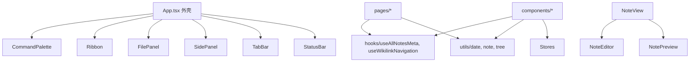

# Design Document · 前端组件化重构

## Overview

纯重构：消除 2 处重复、拆分 3 个胖组件、修复 1 个竞态，行为不变。仅涉及 `frontend/src` 下的 `components/`、`pages/`、`hooks/`、`utils/`（新增），**不碰 `src-tauri`**。

## Steering Document Alignment

### Technical Standards (tech.md)
- 维持 React 19 + TypeScript 5.9 + antd 6 + zustand 5 + dayjs，**不引入新依赖**
- 维持 Tauri v2 IPC 约定（参数 camelCase、返回 snake_case）

### Project Structure (structure.md)
- 新增 `frontend/src/utils/`（纯函数层）；扩展 `frontend/src/hooks/`（已起步 `useAllNotesMeta`，加 `useWikilinkNavigation`）
- 维持 pages / components / stores / api / types 现有分层

## Code Reuse Analysis

### Existing Components to Leverage
- **`useTabsStore.openNote`**：`openNoteFromMeta` 内部复用，不重写跳转逻辑
- **`useVaultStore`**：hook 内取 vault
- **`api.searchNotes` / `api.getNoteContent`**：wikilink 跳转复用
- **`useAllNotesMeta` 的 cancelled flag 模式**：FilePanel 竞态修复直接参照

### Integration Points
- App.tsx → 引入独立 `<CommandPalette />`
- NoteView → 组合 `<NoteEditor />` / `<NotePreview />`
- 各页面/组件 → 接入 `openNoteFromMeta`、`useWikilinkNavigation`

## Architecture

重构后分层：

## Components and Interfaces

### useWikilinkNavigation（新 hook · `hooks/useWikilinkNavigation.ts`）
- **Purpose**：封装「点击 `.helmose-wikilink` → 搜目标 → 跳转/替换」
- **Interfaces**：`useWikilinkNavigation(opts?: { onNavigate?: (note) => void }): { handleClick: (e: MouseEvent<HTMLElement>) => Promise<void> }`
  - 默认行为 = `openNote`（NoteView 用）；`onNavigate` 回调用于 TasksPage「替换 Drawer 内容」场景
- **Dependencies**：`useVaultStore`、`useTabsStore.openNote`、`api.searchNotes`
- **Reuses**：`NoteView.onPreviewClick`（[NoteView.tsx:51-71](frontend/src/components/NoteView.tsx#L51-L71)）/ `TasksPage.onDrawerClick`（[TasksPage.tsx:119-137](frontend/src/pages/TasksPage.tsx#L119-L137)）现有逻辑

### openNoteFromMeta（`utils/note.ts`）
- **Purpose**：消除 `{id,title,file_name,rel_path}` 重复映射
- **Interfaces**：`openNoteFromMeta(meta: { id; title: string|null; file_name: string; rel_path: string }): void`（内部调 `useTabsStore.getState().openNote(meta)`）
- **Reuses**：`useTabsStore.openNote`

### CommandPalette（新组件 · `components/CommandPalette.tsx`）
- **Purpose**：命令面板独立，App.tsx 减负
- **Interfaces**：`<CommandPalette />`（自管状态，读 `useTabsStore.paletteOpen/setPalette`）
- **Dependencies**：`useVaultStore`、`useTabsStore`、`api.searchNotes`
- **Reuses**：App.tsx 现有 `CommandPalette` 函数体（[App.tsx:24-93](frontend/src/App.tsx#L24-L93)）原样搬迁

### utils 层（新）
- **`utils/date.ts`**：`dateKey(s: string|null): string|null`（从 CalendarPage 迁入）
- **`utils/note.ts`**：`extractOutline(raw: string): OutlineItem[]`（从 NoteView 迁入）、`openNoteFromMeta(meta)`
- **`utils/tree.ts`**：`makeCompare(mode)`、`childDirs(dir, dirs)`、`fileIcon(name)`（从 FilePanel 迁入）
- **Reuses**：各组件现有纯函数原样迁入，签名/返回值不变

### NoteEditor（新组件 · `components/NoteEditor.tsx`）
- **Purpose**：编辑模式（CodeMirror + marked 实时预览 + 保存/取消）
- **Interfaces**：`<NoteEditor noteId rawContent onSave(updated) onCancel />`
- **Reuses**：NoteView 编辑分支（CodeMirror + marked 分屏 + save 逻辑）

### NotePreview（新组件 · `components/NotePreview.tsx`）
- **Purpose**：阅读模式（HTML + wikilink 跳转）
- **Interfaces**：`<NotePreview html />`（内部用 `useWikilinkNavigation`）
- **Reuses**：NoteView 阅读分支

### NoteView（重构为容器）
- **Purpose**：协调加载/阅读/编辑切换，组合 `NoteEditor`/`NotePreview`
- **Reuses**：现有加载 + outline/backlink 同步（`setActiveNoteData`）逻辑

### FilePanel 竞态修复
- **Purpose**：`listDirs + listAllNotesMeta` 加 cancelled flag
- **Reuses**：`useAllNotesMeta` 的 cancelled 模式（[useAllNotesMeta.ts:22-49](frontend/src/hooks/useAllNotesMeta.ts#L22-L49)）

## Data Models

无新数据模型。复用 `NoteMeta` / `NoteContent` / `SearchResult` / `OutlineItem`。

## Error Handling

- 维持各处 catch + console.error（不静默）
- `useWikilinkNavigation` 跳转失败静默忽略（与现状一致）
- FilePanel 竞态：过期响应丢弃（cancelled flag）

## Testing Strategy

### Unit Testing
- utils 纯函数（`dateKey`/`extractOutline`/`makeCompare`/`childDirs`）可加 co-located 单测。注：项目当前无前端测试框架，单测为可选增强，非阻断项。

### Integration Testing / 行为回归
- `npm run tauri:dev` 手动验证与重构前逐项一致：阅读视图、编辑保存（含备份提示）、wikilink 跳转、反向链接、文件树展开/搜索/排序、命令面板、标签折叠。

### 客观裁判
- `cd src-tauri && cargo check` + `cargo test`（18 绿不回归）
- `cd frontend && npm run build`（tsc 类型 + vite 构建）
