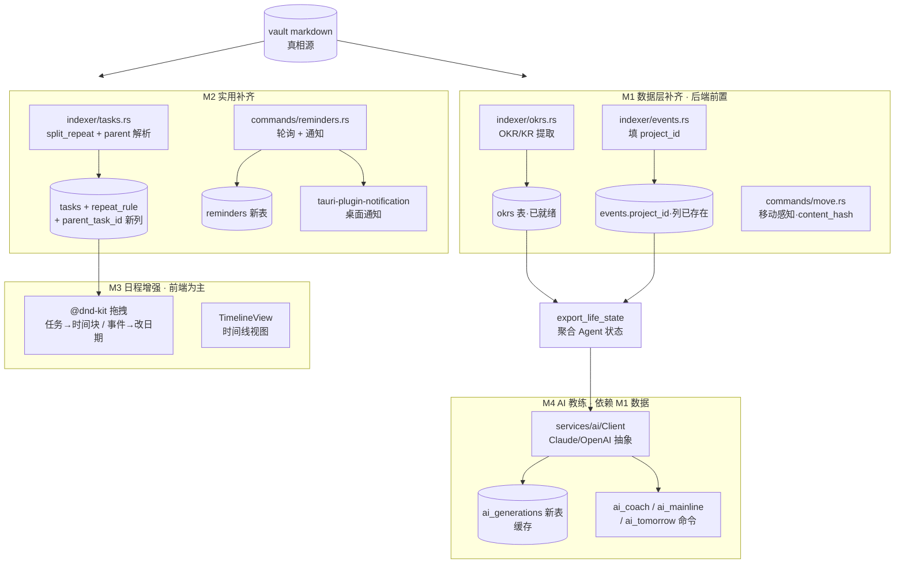

# Design Document · plan-todo-completeness（计划/TODO 完整性补齐）

> 本 spec 为 Helmose v0.2 计划/TODO 完整性补齐总纲。写作铁律：中文 + mermaid 架构图 + Code Reuse Analysis + 对齐 steering + 契约驱动。

## Overview

本设计把 Helmose 从「能浏览能编辑的本地知识库」推进到「能驱动行动 + 有 AI 教练的人生操作系统」，分四条主线落地：

- **M1 数据层补齐**：让已就绪但空着的 `okrs` 表 / `events.project_id` 列真正填上数据，并补齐移动感知（引用不断链）。纯后端，是 M4 AI 教练的输入前置。
- **M2 实用补齐**：到期提醒通知 + 重复任务 + 子任务嵌套。后端解析（扩展 tasks indexer）+ 前端 + 桌面通知。纯本地，不依赖 LLM。
- **M3 日程增强**：任务拖进日历做时间块 + 事件拖拽改日期 + 时间线视图。前端为主，复用已装的 @dnd-kit。
- **M4 AI 教练层**：可替换 LLM 抽象层（Claude/OpenAI）+ 主线判定 + 每日教练 + 明日一句。顶层，依赖 M1 的完整数据。

**设计原则**

- **契约零侵入**：OKR 解析不加新 `type`，复用 `strategy`/`project`（memory 教训：改 contract NOTE_TYPES 触发 6 测试红 + scaffold 模板数连锁）。
- **最小 schema 改动**：能用现有列/表的绝不新建（`okrs` 表已就绪、`events.project_id` 列已存在）；必须新增的（tasks.repeat_rule/parent_task_id、reminders 表）走幂等 migration。
- **写 vault 统一收口**：所有写操作（重复推进、时间块写事件、AI 写明日寄语）经现有 `append_bullet`/`update_line`/`save_note_content_inner`（含 `.helmose/backup` 备份），不自写 `fs::write`。
- **AI 数据最小化 + 可降级**：LLM 只发聚合摘要不发原文；未配 key / 调用失败 → 本地启发式 → 上次快照 → 空态，四级降级。
- **AI 层可替换**：`services::ai::Client` trait 化，provider 可插拔（本期 Claude/OpenAI，未来 Ollana 本地）。

## Steering Document Alignment

### Technical Standards (tech.md)
- Rust edition 2021；模块经 `mod.rs` 暴露；跨模块 `crate::` 绝对路径。
- 命令 `#[tauri::command] fn ... -> Result<T, String>`，错误统一 `.map_err(|e| e.to_string())?`。
- IPC 返回 snake_case；前端 TS 接口对齐。
- indexer「纯解析不写库」——`parse_file` 返回结构体，写库在 `commands/` 层。OKR / repeat_rule / 子任务解析都在 indexer 层提取，commands 层写库。
- AI 调用属 `services::ai`（HTTP + 解析），不污染 indexer；indexer 仍纯本地解析。

### Project Structure (structure.md)
- 新模块：`services/indexer/okrs.rs`（OKR 解析）、`services/ai/{mod.rs,client.rs,providers/}`（LLM 抽象）、`commands/{okrs.rs,move.rs,reminders.rs,ai.rs}`。
- DTO：`models/{okr.rs,reminder.rs,ai.rs}`。
- 前端：`components/tasks/TimelineView.tsx`、`components/okrs/OkrBoard.tsx`、`components/ai/AiCoachCard.tsx`、`components/ReminderConfig.tsx`。
- note_type/目录判定复用 `services::contract`（架构铁律 4），不自写前缀映射。

## Code Reuse Analysis

### Existing Components to Leverage

- **`okrs` 表 schema（[database.rs:194-205](../../../src-tauri/src/services/database.rs#L194)）**：已就绪（id/quarter/objective/priority/kr_text/target_value/current_value/raw_row/source_note_id）。M1.1 零 DDL，只需 indexer 填充 + 命令查询。
- **`events.project_id` 列（[database.rs:173](../../../src-tauri/src/services/database.rs#L173)）**：列已存在，M1.2 只需 indexer 填充。
- **`indexer/projects.rs` 两层提取（extract + apply_global_passes）**：M1.1 OKR 解析仿此模式——extract() 从「关键结果」section 提 KR，全局 pass 算 objective 汇总。
- **`indexer/tasks.rs` split_* 提取+清理模式（split_due/split_priority）**：M2.2 `split_repeat` 完全对称——正则提 `🔁 every xxx` + 从 text 清理。
- **`indexer/sections.rs split_sections_with_lines`**：M1.1 OKR section 定位 + M2.3 子任务缩进解析复用其行号追踪。
- **`save_note_content_inner` / `append_bullet` / `update_line` / `delete_line`（[library.rs](../../../src-tauri/src/commands/library.rs)）**：M2.2 重复推进、M3.1 时间块写事件、M3.2 事件改日期、M4.3 写明日寄语，全部经此收口（备份 + 重索引）。
- **`content_hash`（indexer/mod.rs）**：M1.3 移动感知靠它识别「同一篇换位置」，只更新索引不碰原文。
- **`export_life_state`（[life_state.rs](../../../src-tauri/src/commands/life_state.rs)）**：M4 在此扩展——`okrs` 字段从写死 `[]`（line 120）改为真实查询；新增 `today_focus` / AI 主线写入 `life_state_snapshots`。
- **`tomorrow_sentences` 表 + `indexer/tomorrow.rs`**：M4.3 明日一句复用此表与解析（已就绪），AI 生成后写入同结构。
- **`@dnd-kit/core+sortable`（ux-overhaul task 17 已装）**：M3.1/M3.2 拖拽复用，零新前端依赖。
- **`projects.rs apply_global_passes` top-3 主线启发式**：M4.2 AI 主线判定的降级兜底（LLM 失败时退回此规则）。

### Integration Points
- **Database / tasks 表**：加 `repeat_rule TEXT` + `parent_task_id TEXT` 两列（M2.2/M2.3），migration 仿 [database.rs:61-89](../../../src-tauri/src/services/database.rs#L61) tasks.status/priority/urgency 模式。
- **Database / 新建 reminders 表**（M2.1）：id/note_id/vault_id/task_id/remind_at/fired/created_at + idx_remind_at。
- **Database / 新建 ai_generations 表**（M4，缓存 AI 结果避免重复调用 + 省钱）：id/vault_id/date_iso/feature/mainline|coach|tomorrow/content/created_at。
- **`commands/index.rs index_vault_inner`**：编排里加 okrs 提取 pass（仿现有 projects/events 提取插入点）。
- **`commands/index.rs` 回填 project_id 链路**：现有 tasks.project_id 回填逻辑（按 fm.project 名匹配）扩展到 events.project_id（M1.2，同模式）。
- **`main.rs invoke_handler!`**：注册 list_okrs / move_note / rename_note / list_reminders / ai_coach / ai_mainline / ai_tomorrow 等新命令。
- **前端 `api/index.ts` + `types/index.ts`**：对齐新命令与 DTO（snake_case）。

## Architecture



**关键流向**：vault markdown → indexer 解析（M1 OKR/events.project_id + M2 repeat/parent）→ SQLite 派生缓存 → M3 前端拖拽消费 tasks/events + M4 AI 聚合状态送 LLM → AI 结果写回 `life_state_snapshots` / `ai_generations` + 按需写 vault（明日寄语）。**M1 是 M4 的输入前置**（AI 需要 OKR 进度才能判主线），**M2/M3 相对独立可并行**。

### Modular Design Principles
- **单一文件职责**：`indexer/okrs.rs` 只管 OKR 解析、`services/ai/` 只管 LLM 调用、`commands/reminders.rs` 只管提醒调度。
- **AI 层隔离**：`services::ai::Client` trait，业务命令（ai_coach 等）只依赖 trait 不依赖具体 provider，provider 切换零业务改动。
- **契约集中**：OKR 不加 type，靠 section 关键词（关键结果/KR/OKR/目标）+ frontmatter.type∈{strategy,project} 双条件识别。
- **写 vault 收口集中**：所有写路径汇聚 `library.rs` 的 save/append/update/delete_inner。

## Components and Interfaces

### M1.1 · `services/indexer/okrs.rs`（新建）
- **Purpose**：从 strategy/project 文档提取 OKR + KR 填 `okrs` 表。
- **Interfaces**：
  - `pub fn extract(parsed: &ParsedNote) -> Vec<ExtractedOkr>` —— 纯函数，识别 frontmatter.type∈{strategy,project} + section 关键词（目标/关键结果/KR/OKR/Key Results），提 objective（section 标题或首行）+ kr_text（bullet）+ target/current（正则 `(\d+\.?\d*)\s*[万千亿]?` 配「目标/当前」字样）。
- **Reuses**：`sections::split_sections_with_lines`（section 定位）、`projects.rs extract` fm 读取模式。
- **开放决策**：不加 `okr` type——OKR 文档在作者 wiki 里多为 `strategy` 或 `project`，加 type 触发 contract 连锁（memory 教训）。用「type∈{strategy,project} AND 含 KR section」双条件识别。

### M1.1 · `commands/okrs.rs`（新建）
- **Purpose**：OKR 查询命令。
- **Interfaces**：
  - `#[tauri::command] fn list_okrs(vault_id: String, quarter: Option<String>) -> Result<Vec<Okr>, String>` —— 按 quarter 可选过滤，ORDER BY quarter DESC, priority。
- **Reuses**：`projects.rs get_projects` SQL 查询模式。

### M1.2 · `indexer/events.rs`（修改）
- **Purpose**：填 `events.project_id`。
- **Logic**：提取事件 bullet 时，若含 `#project:名` 或所在笔记 fm.project 非空，按名匹配 projects 表 id（仿 `index.rs` 现有 tasks.project_id 回填链路 [index.rs:304-318]）。
- **Reuses**：现有 project_id 回填函数，从 tasks 扩展到 events。

### M1.3 · `commands/move.rs`（新建）
- **Purpose**：移动/重命名笔记，索引层更新 + 路径型引用授权更新。
- **Interfaces**：
  - `#[tauri::command] fn move_note(note_id: String, target_dir: String) -> Result<MoveResult, String>` —— content_hash 不变识别同一篇，更新 notes.rel_path + 反链 target_note_id；检测路径型引用（grep `旧路径`）返回 `{refs_to_update: [...]}`。
  - `#[tauri::command] fn apply_ref_updates(note_id: String, ref_locations: Vec<RefLoc>) -> Result<(), String>` —— 用户授权后改这些文档原文（走 save_note_content_inner 备份）。
- **Reuses**：`content_hash`、`get_backlinks/get_forward_links`、`save_note_content` 备份。
- **开放决策**：移动只更新索引（不碰原文）；路径型引用更新需二次授权（分两命令），避免一次操作越权改多篇 vault。

### M2.1 · `commands/reminders.rs`（新建）+ `tauri-plugin-notification`
- **Purpose**：到期提醒调度 + 桌面通知。
- **Interfaces**：
  - `#[tauri::command] fn ensure_reminders(vault_id: String) -> Result<(), String>` —— 扫 tasks 表 due_date 未来 N 天的任务，按设置「提前时长」生成 reminders 行（幂等：已存在 task_id+remind_at 跳过）。
  - `#[tauri::command] fn fire_due_reminders(app: AppHandle) -> Result<usize, String>` —— 前端定时器（setInterval 60s）调用，查 `remind_at <= now AND fired=0`，逐条发 notification + 标 fired=1。
- **Reuses**：`idx_tasks_due` 索引；`tauri-plugin-notification`（新依赖，Cargo.toml + tauri.conf.json plugins 注册）。

### M2.2 · `indexer/tasks.rs`（修改）+ `commands/tasks.rs`
- **Purpose**：重复任务解析 + 完成时推进。
- **Logic**：
  - `split_repeat(text) -> (Option<String>, String)` —— 正则 `🔁\s*every\s+(\S+)` 提 rule（day/week/month/Mon-Sun），清理 text（对称 split_due）。
  - `#[tauri::command] fn toggle_task(...)` 现有命令：若 task.repeat_rule 非空，改语义为「推进 due_date 到下一周期 + 保持 unchecked」而非标 done（在 toggle_task_inner 内分支）。
- **Reuses**：`split_due` 提取清理模式；`toggle_task_inner` 拆行骨架；日期推进用 `utils::dates` 加周期。

### M2.3 · `indexer/tasks.rs`（修改）
- **Purpose**：子任务嵌套解析。
- **Logic**：checkbox 提取通道 A 内，检测 bullet 缩进（行首空格/tab 数），缩进 >0 的 bullet 的 parent_task_id 指向最近的上一条非缩进任务（栈式匹配）。
- **Reuses**：现有 checkbox 通道 A 提取骨架，加缩进层级追踪。

### M3.1/M3.2 · 前端 `CalendarPage.tsx` + 新 `TimeBlockDnd` 层
- **Purpose**：任务→时间块拖拽、事件拖拽改日期。
- **Logic**：CalendarPage 接受来自 TasksPage 的 drag payload（task）；日历单元格 + 时段为 droppable；onDrop 调 `ensureDayNote` + `appendBullet('关键事件', bullet)`。事件改日期 = `deleteLine` 旧 + `appendBullet` 新（同跨日移动语义）。
- **Reuses**：`@dnd-kit`（已装）、`ensureDayNote`、`appendBullet/deleteLine`、`utils/quickAdd.ts buildEventBullet`。

### M3.3 · `components/tasks/TimelineView.tsx`（新建）
- **Purpose**：时间线第四视图。
- **Logic**：横向时间轴（今日中轴，前后 ±30 天），任务按 due_date 落点；无 due_date 归「未排期」侧栏；同日多条堆叠 + 计数角标。数据源复用 TasksPage 一次 `getTasks` 拉取，内存切视图。
- **Reuses**：`taskView` store（加 `'timeline'` 到 view 联合类型）、`TaskCard`、`ListView/KanbanView/MatrixView` 兄弟模式。

### M4.1 · `services/ai/{mod.rs, client.rs, providers/}`（新建）
- **Purpose**：可替换 LLM 调用层。
- **Interfaces**：
  - `pub trait AiClient { async fn complete(&self, system: &str, user: &str) -> Result<String, AiError>; }`
  - `pub fn build_client(settings: &AiSettings) -> Option<Box<dyn AiClient>>` —— 按 provider（Claude/OpenAI）+ key 构造，key 空返回 None。
  - providers/claude.rs（messages API）、providers/openai.rs（chat completions），各自实现 trait。
- **Reuses**：`reqwest`（已在 Cargo.toml，确认；若无则加）、`serde_json`。
- **开放决策**：异步用 `async fn` + tokio（Tauri 命令 `async`）；调用超时 30s；输入 token 预算硬上限（如 4k）—— 聚合状态摘要天然小，不会超。

### M4.2/M4.3 · `commands/ai.rs`（新建）
- **Purpose**：AI 主线判定 / 每日教练 / 明日一句。
- **Interfaces**：
  - `#[tauri::command] async fn ai_mainline(vault_id, db, app) -> Result<AiMainline, String>` —— 聚合 active projects（priority/mainline/last_activity/OKR 进度）→ build_client → prompt → 解析「主线名+理由」→ 写 `life_state_snapshots.mainline_project` + `ai_generations`。LLM 失败退 `projects.rs apply_global_passes` top-3。
  - `#[tauri::command] async fn ai_coach(vault_id, db) -> Result<String, String>` —— 聚合（今日完成/待办/逾期/主线 OKR）→ prompt → 写 `life_state_snapshots.today_focus` + `ai_generations`。
  - `#[tauri::command] async fn ai_tomorrow(vault_id, db) -> Result<(), String>` —— 聚合（明日待办/事件/主线）→ prompt → 写当日笔记「明日寄语」section（append_bullet 收口）+ `tomorrow_sentences` 表。
- **Reuses**：`export_life_state` 聚合逻辑（抽公共 `gather_state`）、`append_bullet` 写回、`tomorrow_sentences` 表。

## Data Models

### Okr（M1.1，新增 DTO，对齐 okrs 表）
```rust
#[derive(Debug, Clone, Serialize)]
pub struct Okr {
    pub id: String,
    pub source_note_id: String,
    pub quarter: Option<String>,    // 如 "2026Q3"，从 frontmatter.quarter 或标题推断
    pub objective: String,           // 目标
    pub priority: String,            // P0/P1/P2/P3，缺省 P2
    pub kr_text: Option<String>,     // 关键结果
    pub target_value: Option<String>,
    pub current_value: Option<String>,
}
```

### Reminder（M2.1，新增 DTO）
```rust
#[derive(Debug, Clone, Serialize)]
pub struct Reminder {
    pub id: String,
    pub task_id: String,
    pub note_id: String,
    pub remind_at: String,    // ISO8601
    pub fired: bool,
    pub task_text: String,     // 冗余存通知时用，免得再 join
    pub due_date: Option<String>,
}
```

### AiSettings / AiMainline / AiGeneration（M4）
```rust
#[derive(Debug, Clone, Serialize, Deserialize)]
pub struct AiSettings {
    pub provider: String,          // "claude" | "openai"
    pub api_key: String,           // 存 app_data_dir，不入 vault
    pub enabled: bool,
}
#[derive(Debug, Clone, Serialize)]
pub struct AiMainline {
    pub project_name: String,
    pub reason: String,
    pub source: String,            // "ai" | "heuristic"（降级标注）
}
```

### Database 改动（最小）
- **tasks 表加 2 列**（M2.2/M2.3，migration 仿 [database.rs:61-89](../../../src-tauri/src/services/database.rs#L61)）：
  - `ALTER TABLE tasks ADD COLUMN repeat_rule TEXT`（NULL=非重复）
  - `ALTER TABLE tasks ADD COLUMN parent_task_id TEXT`（NULL=顶层任务）
- **新建 reminders 表**（M2.1）：
  ```sql
  CREATE TABLE IF NOT EXISTS reminders (
    id TEXT PRIMARY KEY, task_id TEXT NOT NULL, note_id TEXT NOT NULL,
    vault_id TEXT NOT NULL, remind_at TEXT NOT NULL, fired INTEGER NOT NULL DEFAULT 0,
    task_text TEXT NOT NULL, due_date TEXT, created_at TEXT NOT NULL
  );
  CREATE INDEX IF NOT EXISTS idx_reminders_at ON reminders(remind_at);
  ```
- **新建 ai_generations 表**（M4，缓存 + 省 token）：
  ```sql
  CREATE TABLE IF NOT EXISTS ai_generations (
    id TEXT PRIMARY KEY, vault_id TEXT NOT NULL, date_iso TEXT NOT NULL,
    feature TEXT NOT NULL, content TEXT NOT NULL, created_at TEXT NOT NULL,
    UNIQUE(vault_id, date_iso, feature)
  );
  ```
- **okrs / events.project_id**：零改动（已就绪）。

## Error Handling

1. **OKR / repeat / 子任务解析失败** → **Handling**: 留 NULL / 当普通任务，不报错（契约容错） / **User Impact**: 无感（部分识别）。
2. **LLM 调用失败（网络/超时/限流/key 无效）** → **Handling**: 降级本地启发式（主线退 top-3）+ 静默日志 + 读 `ai_generations` 上次缓存 / **User Impact**: UI 标「本地推断（未接 AI）」或显示上次结果，不弹错。
3. **未配 API key** → **Handling**: build_client 返回 None，AI 命令直接走降级 / **User Impact**: TodayPage AI 卡片显「未配置 AI，去设置」按钮。
4. **移动笔记路径型引用更新写盘失败** → **Handling**: 回滚索引更新 + toast 报错 / **User Impact**: 「移动失败，已还原」。
5. **通知权限被拒（macOS）** → **Handling**: ensure_reminders 仍生成数据，fire 时检测权限拒绝则跳过 + 设置页提示 / **User Impact**: 不崩，提醒静默失效 + 引导授权。
6. **AI 生成内容写回 vault 失败**（M4.3 明日寄语） → **Handling**: 不写 + 返回错误 + UI 显原文可复制 / **User Impact**: 「保存失败，可手动粘贴」。

## Testing Strategy

### Unit Testing
- `indexer/okrs.rs::extract`：构造 strategy 文档（含「## 关键结果」+ KR bullet + target/current 数值）断言提取正确；无 KR section 返回空；type 非 strategy/project 返回空。
- `indexer/tasks.rs::split_repeat`：`- [ ] 周报 🔁 every week` → rule=Some("week"), text="周报"；无 🔁 → None；语法错（`🔁 abc`）→ None 当普通。
- `indexer/tasks.rs` 子任务缩进：父+缩进子 → parent_task_id 正确；多层缩进取最近非缩进父。
- `services/ai::build_client`：key 空 → None；provider=claude + key → 返回 ClaudeClient；未知 provider → None。
- `commands::move_note`：content_hash 不变识别同一篇；路径型引用检测返回正确 N 处。

### Integration Testing
- `list_okrs` 端到端：建 strategy 笔记（OKR section）→ index_vault → list_okrs 返回正确条目。
- `toggle_task` 重复推进：建带 🔁 every week + due 的任务 → toggle → 断言 due_date 推进 7 天 + 仍 unchecked。
- `ai_mainline` 降级链：mock LLM 失败 → 退回 apply_global_passes top-3 + source="heuristic"；mock 成功 → source="ai"。

### End-to-End（现有 smoke test）
- `index_real_wiki_smoke`：对 `~/wiki`（或 `HELMOSE_TEST_VAULT`）真实 1.9 万 md 跑全量索引，验证 OKR 解析不崩 + 含 `🔁`/缩进子任务的任务被正确识别 + events.project_id 部分填充（有 #project 标签的）。
- AI smoke：未配 key 时 `ai_mainline` 走降级返回 heuristic，不崩。
