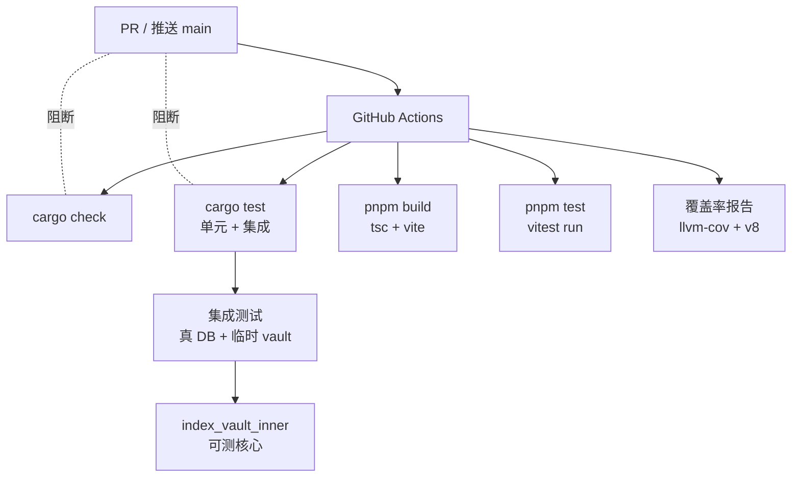

# Design Document · test-infra（测试基建 + CI 门禁）

## Overview

补 Helmose 测试金字塔的**中层**（后端写库集成测试）与 **CI 质量门禁**，并加覆盖率报告。三条主线：

1. **可测性重构**：`index_vault` 拆出 `index_vault_inner(vault_id, &Database)`，让核心写库逻辑可被直接调用测试（绕过 Tauri `State`）。
2. **后端集成测试**：用真 SQLite + 真临时文件系统（**不 mock**），覆盖 `index_vault` 写库 + 关键 IPC 命令。
3. **CI 门禁 + 覆盖率**：GitHub Actions 把 `cargo check/test + pnpm build/test` 焊成 PR 门禁，附 cargo-llvm-cov / vitest coverage 报告。

**设计原则**
- **不 mock 数据层**：集成测试跑真实 rusqlite + 真实临时文件系统（复用 `incremental::tests::setup` 模式）。
- **行为不变**：`index_vault_inner` 重构是纯可测性改动，命令对外行为零变化。
- **CI 先报告后门槛**：覆盖率本阶段只可见，不阻断；避免新 spec 被门槛卡。

## Steering Document Alignment

### Technical Standards (tech.md)
- Rust `cargo test` + 前端 `vitest` 已是客观裁判，本 spec 把它们 CI 化 + 补集成层。
- 测试内嵌 `#[cfg(test)] mod tests`（现有约定）；CI workflow 放 `.github/workflows/`。

### Project Structure (structure.md)
- 集成测试与单元测试同文件 `#[cfg(test)] mod tests`，复用 setup helper。
- CI workflow 是项目首个 `.github/workflows/` 文件。

## Code Reuse Analysis

### Existing Components to Leverage
- **`incremental::tests::setup`（[incremental.rs:237](../../../src-tauri/src/services/indexer/incremental.rs#L237)）**：构造真 DB + 临时 vault 目录 + 注册 vault → 复用此模式做 `index_vault` 集成测试的 setup。
- **`scaffold::tests::tmp`（[scaffold.rs](../../../src-tauri/src/commands/scaffold.rs)）**：唯一临时目录模式（pid + unique）→ 复用做 vault 目录命名。
- **现有 40 单测**：不动，集成测试是新增。

### Integration Points
- `index_vault_inner` 被 `#[tauri::command] index_vault` 调用 + 被集成测试直接调用。
- CI workflow 调 `cargo` / `pnpm`（现有命令）。
- 覆盖率：cargo-llvm-cov 包装 `cargo test`；`@vitest/coverage-v8` 包装 `vitest`。

## Architecture

关键：`index_vault_inner` 拆出后，集成测试直接调它（带 `&Database`），不需 Tauri `State`。

## Components and Interfaces

### Component 1：`index_vault_inner` 可测性重构（commands/index.rs）
- **Purpose**：把 `index_vault` 核心逻辑拆出可测函数。
- **改动**：
  - 新增 `pub fn index_vault_inner(vault_id: &str, db: &Database) -> Result<IndexStats, String>`，承载原 `index_vault` 全部业务逻辑（遍历 + 解析 + 碰撞消歧 + 事务写库）。
  - `#[tauri::command] pub fn index_vault(vault_id: String, db: State<'_, Database>) -> Result<IndexStats, String>` 仅做 `index_vault_inner(&vault_id, db.inner())`。
  - 同理对 `should_reindex` 拆 `should_reindex_inner(vault_id, &Database) -> Result<bool, String>`（如需集成测）。
- **行为不变**：前端 `invoke('index_vault')` 完全不感知。
- **Reuses**：原 `index_vault` 逻辑（原样移入 inner）。

### Component 2：后端写库集成测试（commands/index.rs 的 `#[cfg(test)] mod tests`）
- **Purpose**：验证 `index_vault_inner` 写库正确性（Req 1）。
- **setup**：复用 `incremental::tests::setup` 模式——临时 vault_dir + 临时 db_path + `Database::new` + `init_schema` + 注册 vault。
- **测试用例**：
  - 构造小 vault（3 个 md：① `type:project` frontmatter、② 普通 md、③ 含 checkbox + `[[wikilink]]` 的 md）。
  - 调 `index_vault_inner` → 断言：`notes.id` 全为 64 位 hex、`notes.content_hash` 非 null、`projects` 表 count ≥ 1（type=project 命中）、`tasks` 表有行、`links` 表有行且外键有效。
  - 移动文件（改 rel_path，内容不变）→ 再次 `index_vault_inner` → 断言该 note 的 `id` 不变（content_hash 稳定）。
- **Reuses**：`incremental::tests::setup`、`scaffold::tests::tmp`。

### Component 3：关键命令集成测试
- **`add_vault` + `delete_vault` 往返**（commands/vault.rs tests）：注册 → list 查到 → delete → notes/tasks/links 级联清理。
- **`save_note_content` 链路**（commands/library.rs tests 或 index）：写内容 → `.helmose/backup/` 备份存在 → FTS 命中新内容 → 增量重索引 tasks/links 同步。
- **`scaffold_vault` → `index_vault_inner` 链路**：scaffold 生成 → add_vault → index_vault_inner → 断言骨架模板 md 入库。
- **Reuses**：vault.rs / library.rs / scaffold.rs 现有命令。

### Component 4：CI workflow（`.github/workflows/ci.yml`）
- **触发**：`pull_request` + `push` to main。
- **Jobs**：
  - `backend`（matrix: macos-latest + ubuntu-latest）：`cargo check` + `cargo test`（含集成）。
  - `frontend`（ubuntu-latest）：`pnpm install` + `pnpm build` + `pnpm test`。
- **缓存**：`Swatinem/rust-cache`（cargo）+ `pnpm/action-setup` + `actions/setup-node`（pnpm store）。
- **注**：项目当前无 git remote，workflow 写好 + 本地 `actionlint` 校语法，待推 GitHub 启用。

### Component 5：覆盖率报告
- **Rust**：`cargo-llvm-cov`（比 tarpaulin 快、rustc 原生）跑 `cargo test`，生成 lcov，上传 artifact。
- **前端**：加 devDep `@vitest/coverage-v8`，`pnpm test --coverage`，生成 lcov。
- **本阶段只报告**，不设门槛、不阻断 PR。

## Data Models

无新模型。`index_vault_inner` 复用 `IndexStats`（已有）。

## Error Handling

1. **测试 setup 失败**（DB init / 目录创建）→ 测试 panic（标准 `unwrap`），CI 红叉。
2. **CI 步骤失败** → GitHub Actions 红叉，阻断 PR。
3. **`index_real_wiki_smoke` 在 CI**：无 `~/wiki` 时现有逻辑 `if !Path::exists() return` 自动跳过（已是 `#[ignore]` 候选，本 spec 可加 `#[ignore]` 让 CI 显式跳过，本地 `cargo test -- --ignored` 跑）。

## Testing Strategy

- 集成测试本身即测试基建。验收：
  - **Unit/Integration**：`cargo test` 含新增集成测试全绿；`index_vault_inner` 重构后现有 40 单测不回归。
  - **CI workflow 语法**：`actionlint`（本地或 CI）校验 `.github/workflows/ci.yml` 语法正确。
  - **覆盖率**：cargo-llvm-cov / vitest coverage 能跑通并产出 lcov。

## 开放决策

- **CI 平台**：GitHub Actions（假设项目将推 GitHub；当前无 remote，workflow 待启用）。
- **覆盖率工具**：cargo-llvm-cov（比 tarpaulin 快，rustc 原生 instrumentation）。
- **覆盖率门槛**：本阶段不设（只报告），后续 spec 设增量门槛（如新增代码 ≥ 80%）。
- **`index_real_wiki_smoke`**：加 `#[ignore]` 标记为本地可选（避免 CI 因无 ~/wiki 误判；现有逻辑已 skip，加 ignore 更显式）。
