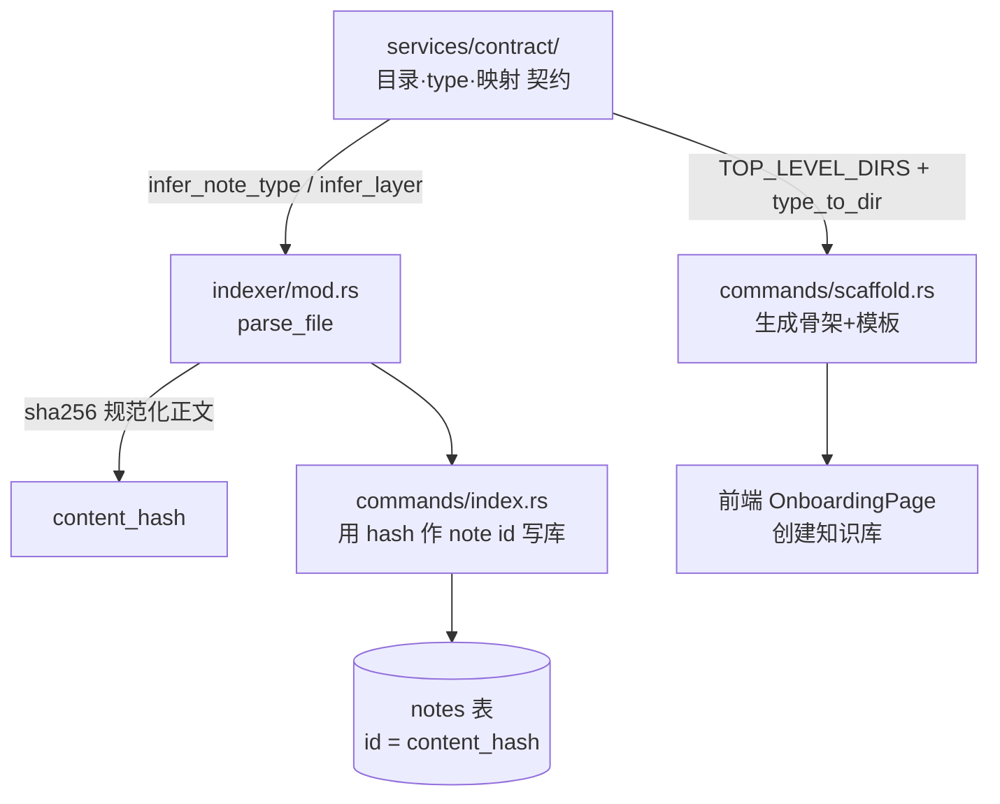

# Design Document · vault-paradigm-scaffold（契约地基 + note-id + 脚手架）

## Overview

本设计把 vault-paradigm 总纲的**阶段 0A + 0B + 1** 落地为 Helmose 的「契约地基」。三条主线：

1. **契约层（0B）**：把 `~/wiki/规范.md` 这套成熟契约内置为单一模块 `services/contract/`，取代 `layers.rs` 硬编码旧编号；`note_type`/`layer` 判定改为契约驱动 + 容错降级。
2. **note-id 稳定化（0A）**：用规范化正文 sha256 作 note 主键，取代当前每次全量索引随机的 uuid；`notes.content_hash` 列已就绪，只动写入逻辑，无 DDL。
3. **脚手架（1）**：新增 `commands/scaffold.rs`，让新用户 onboarding「创建我的知识库」一键生成 00~09 骨架 + 11 种 type 模板。

**设计原则**
- **契约单一真相源**：`services/contract/` 被 indexer 与 scaffold 双向消费；`layers.rs` 退化为对契约的薄封装。
- **零 vault 侵入**：0A/0B 只读 vault（纯索引侧）；脚手架仅对**空目录**写（新建 vault 豁免），`~/wiki` 原文不碰。
- **最小 schema 改动**：`notes.content_hash` 列已存在；note id 改 hash 只改写入值，无 DDL、无迁移脚本。

## Steering Document Alignment

### Technical Standards (tech.md)
- Rust edition 2021；模块经 `services/mod.rs` 暴露；跨模块 `crate::` 绝对路径。
- 命令 `#[tauri::command] fn ... -> Result<T, String>`，错误统一 `.map_err(|e| e.to_string())?`。
- IPC 返回 snake_case；前端 TS 接口对齐。
- indexer 继续「纯解析不写库」——`parse_file` 返回 `ParsedNote`，写库在 `commands/index.rs`。

### Project Structure (structure.md)
- 新模块 `services/contract/`（snake_case）；在 `services/mod.rs` 加 `pub mod contract;`。
- 新命令 `commands/scaffold.rs`（按领域拆分）；在 `commands/mod.rs` 加 `pub mod scaffold;`，`main.rs` `invoke_handler` 注册。
- 新 DTO `ScaffoldStats` 放 `models/`；前端 `types/index.ts` + `api/index.ts` 对齐。

## Code Reuse Analysis

### Existing Components to Leverage
- **`frontmatter::parse`（[frontmatter.rs](../../../src-tauri/src/services/indexer/frontmatter.rs)）**：已返回去 frontmatter 的正文 `fm.content` —— 直接作 content hash 输入，无需重写解析。
- **`parse_file`（[indexer/mod.rs](../../../src-tauri/src/services/indexer/mod.rs)）**：已组装 `ParsedNote`，`content_hash` 字段已存在（当前填 `None`）—— 改为在此算 hash 填入。
- **`index_vault` 事务（[index.rs](../../../src-tauri/src/commands/index.rs)）**：`DELETE FROM notes WHERE vault_id` 触发 `ON DELETE CASCADE` 级联清 tasks/links/projects，再 INSERT —— note id 改 hash 后，全量重建**自然迁移外键**，无需迁移脚本。
- **`EXCLUDE_DIRS` 组件名匹配（`is_excluded`）**：按路径任一组件名匹配，新体系下「6-原始资料」「专家团」组件名保留 → 仍正确排除（见 Component 5）。
- **`default_excludes`（[vault.rs](../../../src-tauri/src/commands/vault.rs)）**：onboarding 排除清单思路，脚手架复用。

### Integration Points
- **Database/notes 表**：`id` PK 由 uuid → content_hash；`content_hash` 列从 `None` → 实填。无 DDL。
- **`incremental::upsert_rel`**（被 `save_note_content` 调用）：同步用 content_hash 作 id，与全量保持一致（细节在 tasks 阶段读 `incremental.rs` 落实）。
- **`main.rs` `invoke_handler`**：注册 `scaffold_vault`。
- **前端 `OnboardingPage`**：加「创建我的知识库」入口 → `scaffold_vault` → `add_vault` → `index_vault`。

## Architecture



关键：`contract` 是被 indexer 与 scaffold 双向消费的单一定义点；`layers.rs` 硬编码被契约取代。

### Modular Design Principles
- 契约集中单文件 `services/contract/mod.rs`（数据量小，暂不拆子文件；后续膨胀可拆 `dirs/types/tags`）。
- hash 计算放 indexer（解析时一次），写入放 commands 层。
- scaffold 独立命令文件，复用 contract 与 `std::fs`。

## Components and Interfaces

### Component 1：契约模块 `services/contract/mod.rs`（阶段 0B）

- **Purpose**：内置 `规范.md` 结构契约，作 indexer/scaffold 唯一依据。
- **Interfaces（pub）**：
  - `TOP_LEVEL_DIRS: &[&str]` —— `00_收件箱` .. `09_核心知识库`（10 个）
  - `NOTE_TYPES: &[&str]` —— 11 种 type
  - `fn type_to_dir(t: &str) -> Option<&'static str>` —— type→存放目录（取自规范.md 映射表）
  - `fn infer_note_type(rel_path: &str, fm_type: Option<&str>) -> Option<String>` —— 判定（见下）
  - `fn infer_layer(note_type: Option<&str>) -> i32` —— type→layer 映射（见 Data Models）
- **`infer_note_type` 判定优先级**（取代 `layers.rs::type_of`）：
  1. `fm_type` ∈ 11 种 → 直接用；
  2. 否则**最长前缀匹配** `type_to_dir` 反查：遍历所有 `(type, dir)`，取 `rel_path` 以 `dir` 开头的最长 `dir` 对应 type（例 `06_学习与资源资产/市场情报/x.md` → 同时匹配 `06_.../` 与 `06_.../市场情报/`，取后者 → `comparison`）；
  3. 否则 `None`（降级）。
- **Dependencies**：无（纯静态数据 + 纯函数）。
- **Reuses**：取代 `layers.rs::type_of` / `layer_of`。
- **开放决策 1 · 契约与规范.md 同步（回应 Req 1.5）**：内置契约为**编译期常量**（默认真相）。脚手架生成新 vault 时写一份人读 `规范.md`。本 spec **不做**对已有 vault `规范.md` 的自动解析同步（自由文本结构化提取复杂易错）；靠**契约容错**（无匹配降级）保证不一致时不崩。自动同步留后续 spec。

### Component 2：note_type/layer 推断重构（阶段 0B，改 `layers.rs`）

- **Purpose**：`parse_file` 改调 `contract::infer_note_type` / `infer_layer`，删旧编号硬编码与私货。
- **改动**：`layers.rs::type_of`/`layer_of` 改为转调 `contract`（或 `parse_file` 直接调 `contract`，`layers.rs` 退化为 re-export / 删除）。移除 `0-日志/1-我/2-业务/5-经历/4-工具与效率/3-学习/2-创作` 与私货 `1-我/张三`→profile。
- **容错（Req 1.3）**：`infer_note_type` 返回 `None` 时 → `note_type=None`、`layer=infer_layer(None)=2`，不报错。
- **Reuses**：contract 模块。

### Component 3：content hash 稳定 id（阶段 0A，改 `indexer/mod.rs` + `commands/index.rs`）

- **Purpose**：规范化正文 sha256 作 note 主键，取代随机 uuid。
- **规范化规则（开放决策 · 回应性能/稳定性）**：
  - 输入 = `frontmatter::parse` 后的 `fm.content`（已去 frontmatter）。
  - 规范化：去 BOM → 行尾统一 LF（`\r\n`/`\r` → `\n`）→ 去每行 trailing 空白 → 去整体首尾空白。
  - `id = sha256(normalized).to_hex()`（64 字符）。
  - 效果：编辑器换行风格差异不改变 hash；真实内容（哪怕一字）变化必改变 hash。
- **接口**：`fn content_hash(body: &str) -> String`（放 `indexer/mod.rs` 或 `utils/hash.rs`）。
- **`parse_file`**：`content_hash` 字段填 `Some(content_hash(&fm.content))`。
- **`index.rs`**：note id 由 `uuid::Uuid::new_v4()` 改为 `p.content_hash.clone()`（碰撞消歧后，见下）。
- **碰撞消解（开放决策 · 回应 Req 2.5）**：
  - 主键 `id = content_hash`。索引时若该 hash 已被同 vault 内**另一 `rel_path`** 占用（= 内容重复），给后入者 `id = format!("{}#{}", content_hash, short_hash(rel_path))` 消歧，并在日志标记「重复内容副本」。
  - 99% 场景（内容唯一）id 纯 hash → **移动不变 id**。重复内容（用户刻意复制）是边缘：消歧后缀含路径，不崩；副本语义细化留阶段 3 引用完整性 spec。
  - `notes.content_hash` 列始终存**纯 content_hash**（不含消歧后缀），供「同内容」判定。
- **外键迁移（开放决策 · 回应 Req 2.6）**：
  - **无独立迁移脚本**。id 切换后首次 `index_vault` 事务内 `DELETE` 旧 notes（`ON DELETE CASCADE` 级联清 tasks/links/projects）→ INSERT 新 hash id。旧 uuid 数据被全量重建覆盖，零手工干预。
  - 用户侧：升级后重新触发一次全量索引（`should_reindex` 会因差异提示，或手动）。
- **Dependencies**：`sha2 = "0.10"`（Cargo.toml 新增）。
- **Reuses**：`frontmatter::parse` 的 `fm.content`。

### Component 4：脚手架 `commands/scaffold.rs`（阶段 1）

- **Purpose**：新用户 onboarding「创建我的知识库」生成规范骨架。
- **Interface**：`#[tauri::command] fn scaffold_vault(target_path: String) -> Result<ScaffoldStats, String>`
- **逻辑**：
  1. 解析 `target_path`。不存在 → 创建；存在且非空 → 检测是否已有 vault（含 `.md` 文件 **或** 含 00~09 任一目录 → 视为已有）。
     - 已有 vault → 返回错误「检测到已有 vault，请用打开/索引」（Req 3.3）。
     - 非空且非 vault → 返回错误「目标目录非空，拒绝铺文件」（Req 3.5）。
  2. 空目录：`mkdir` 00~09（`contract::TOP_LEVEL_DIRS`）。
  3. 生成 11 种 type 模板 md（frontmatter 占位 + 引导文字），放 `contract::type_to_dir(t)` 指定目录（Req 3.2）。
  4. 根目录生成 `规范.md / 目录.md / README.md` 模板（通用版，无私有业务内容，Req 3.4）。
  5. 返回 `ScaffoldStats`。
- **安全（铁律）**：仅对空目录写，新建 vault 豁免无需备份；**绝不写 `~/wiki`**（onboarding 检测已有 vault 即跳过脚手架）。
- **Dependencies**：`contract`（目录/type 映射）、`std::fs`。
- **前端集成**：`OnboardingPage` 加「创建我的知识库」按钮 → 选目录 → `invoke('scaffold_vault')` → 成功后 `add_vault` + `index_vault` → 进主界面。

### Component 5：EXCLUDE_DIRS 契约对齐（Req 4）

- **现状**：`index.rs` 与 `library.rs` 均 `EXCLUDE_DIRS=["6-原始资料","专家团"]`，`is_excluded` 按路径**任一组件名**匹配。
- **新体系核查**：`6-原始资料` 现位于 `08_档案库/原始资料/6-原始资料/`，`专家团` 现位于 `04_关系与社群资产/专家团/` —— **组件名不变，组件名匹配仍正确排除**。
- **决策**：保持 `EXCLUDE_DIRS` 与组件名匹配机制不变（已正确生效）；补注释说明新体系位置；`index.rs` ↔ `library.rs` 加共享说明/互引注释防漂移（当前两处已一致）。隐藏目录（`.obsidian` 等）继续排除。

## Data Models

### note id / content_hash（无 DDL）
- `notes.id`：TEXT PK，值 uuid → `sha256(normalized_body)` hex（碰撞加 `#short` 后缀）。
- `notes.content_hash`：TEXT，纯 content_hash（不含消歧后缀），「同内容」判定用。
- `notes.layer`：i32，由 `contract::infer_layer(note_type)` 填：
  - **L1 高结构**：`project` / `strategy` / `profile` / `person`
  - **L2 半结构**：`book` / `course` / `tool` / `method` / `comparison`；无 type 默认 L2
  - **L3 零结构**：`experience` / `query`

### ScaffoldStats（新增 DTO）
```rust
#[derive(Debug, Clone, Serialize)]
pub struct ScaffoldStats {
    pub root_path: String,
    pub dirs_created: usize,      // 10
    pub templates_created: usize, // 11
    pub root_files_created: usize,// 3
}
```

### 新增依赖
- `Cargo.toml` 加 `sha2 = "0.10"`（content hash）。

## Error Handling

1. **契约无匹配 type** → 降级 `note_type=None`/`layer=2`，不报错（Req 1.3）。用户影响：该笔记仍入库，type 空，可后续手填 frontmatter.type。
2. **content hash 碰撞（重复内容）** → 消歧后缀 + 日志标记，不崩。用户影响：重复文件各保留独立条目；副本语义留阶段 3。
3. **脚手架目标非空非 vault** → 返回错误拒绝写入（Req 3.5）。用户影响：前端弹「目录非空」，引导换空目录。
4. **脚手架目标已是 vault** → 返回错误引导索引（Req 3.3）。用户影响：提示改用「打开已有 vault」。
5. **全量索引失败** → 现有事务回滚 + 日志（已实现）。

## Testing Strategy

### Unit Testing
- `contract::infer_note_type`：11 种 frontmatter.type 各 1 例 + 各 `type_to_dir` 目录反查（含最长前缀区分）+ 无匹配降级。
- `contract::infer_layer`：type→L1/L2/L3 映射 + `None` 默认 L2。
- `content_hash`：规范化稳定性（CRLF/LF 同结果、trailing space 同结果、BOM 同结果）+ 内容微调必变 + 碰撞消歧后缀。
- `scaffold_vault`：临时空目录生成 → 验证 10 目录 + 11 模板 + 3 根文件；非空目录拒绝；已有 vault 拒绝。

### Integration Testing
- `parse_file`：对规范.md 结构样本，验证 note_type/layer/hash 正确。
- `index_vault` 全量：小型测试 vault → 验证 `notes.id` 全为 hash、`content_hash` 列实填、tasks/links 外键有效。

### End-to-End（现有 smoke test）
- `index_real_wiki_smoke`：对 `~/wiki`（`HELMOSE_TEST_VAULT`）真实 1.9 万 md 跑解析，验证新契约 + hash 鲁棒、不崩、`type=project` 正确判定（projects 不再全空）。
