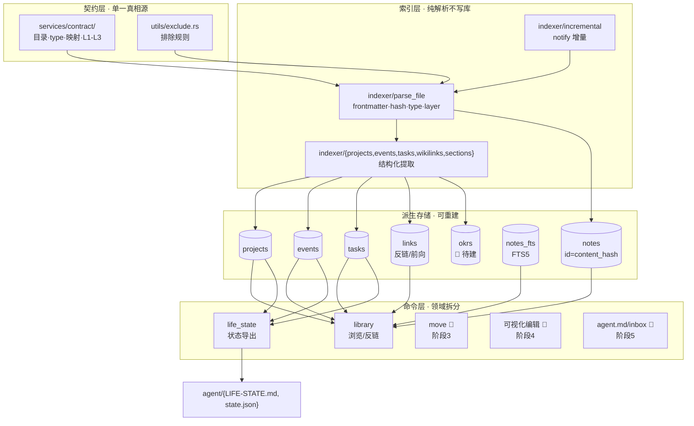

# Design Document · vault-paradigm（范式转移总纲）

> 本 spec 是**总纲路线图**（覆盖阶段 0–5）。本文档记录整体架构愿景 + 各阶段落地映射；
> 每个阶段的实现细节由对应**子 spec**（如 `vault-paradigm-scaffold`）承载。
> 状态基准日：2026-07-01（对照源码 + CLAUDE.md backlog 核对）。

## Overview

本设计把 Helmose 从「被动解析任意 Obsidian vault 的阅读器」转移为「**实现 `规范.md` 契约、主动维护结构骨架与关系网的人生数据底座**」，人读 + Agent 读双导向。一条主线、七个阶段：

| 阶段 | 能力域 | 对应 Req | 落地状态 | 落地子 spec / 实现 |
|---|---|---|---|---|
| 0A | note id 稳定化（content hash） | Req 3 | ✅ 已落地 | `vault-paradigm-scaffold` task 3 |
| 0B | 契约层（内置规范.md） | Req 1 | ✅ 已落地 | `vault-paradigm-scaffold` task 1/2 |
| 1 | 脚手架（安装即生成骨架） | Req 2 | ✅ 已落地 | `vault-paradigm-scaffold` task 4/6 |
| 2 | 结构化数据落地（projects/okrs/events/tasks） | Req 4 | 🟡 部分 | projects/events/tasks due_date ✅；**okrs ❌** |
| 3 | 引用完整性（移动/重命名不断链） | Req 5 | 🟡 部分 | 反链/前向链 ✅；**移动感知 ❌** |
| 4 | 可视化编辑（OKR/看板/任务勾选） | Req 6 | 🔴 未做 | CodeMirror 写回 ✅；可视化 ❌ |
| 5 | Agent 接口（agent.md + 状态接口） | Req 7 | 🟡 部分 | `export_life_state` ✅；**agent.md / inbox 写回 ❌** |

**设计原则（贯穿所有阶段）**
- **契约单一真相源**：`services/contract/mod.rs` 被 indexer / scaffold /（未来）editor 三向消费；`layers.rs` 旧编号硬编码已退化为契约的薄封装。
- **零 vault 侵入**：索引侧纯只读；写 vault（脚手架建新 vault 除外）必须「写前备份 `.helmose/backup/` + 用户明确授权」。
- **最小 schema 改动**：派生表按需新增；note id 切换靠全量 `DELETE ... ON DELETE CASCADE` 自然迁移外键，无独立迁移脚本。
- **派生缓存可重建**：SQLite 是 vault 的派生缓存，删库可从 vault 全量重建——任何时候都不把 SQLite 当主存。

## Steering Document Alignment

### Technical Standards (tech.md)
- Rust edition 2021；模块经 `mod.rs` 暴露；跨模块 `crate::` 绝对路径。
- 命令 `#[tauri::command] fn ... -> Result<T, String>`，错误统一 `.map_err(|e| e.to_string())?`。
- IPC 返回 snake_case；前端 TS 接口对齐（`rel_path`/`note_type`/`last_indexed`/`content_hash`）。
- indexer「纯解析不写库」——`parse_file` 返回 `ParsedNote`，写库在 `commands/index.rs` 事务内。

### Project Structure (structure.md)
- 契约集中 `services/contract/`；排除规则集中 `utils/exclude.rs`（架构铁律 4/5）。
- 命令按领域拆分（`commands/{vault,index,library,scaffold,projects,events,tasks,notes,search,life_state,update}.rs`）。
- indexer 按能力拆子模块（`indexer/{frontmatter,projects,events,tasks,wikilinks,sections,tomorrow,incremental}.rs`）。

## Code Reuse Analysis

### Existing Components to Leverage（已落地的复用基建）
- **`services::contract`（[mod.rs](../../../src-tauri/src/services/contract/mod.rs)）**：目录/type/映射/L1-L3 分层契约，indexer 与 scaffold 双向消费——阶段 2/4 的结构化解析与可视化编辑都以此为单一依据。
- **`indexer::parse_file`（[mod.rs](../../../src-tauri/src/services/indexer/mod.rs)）**：已组装 `ParsedNote`（含 `content_hash`、`note_type`、`layer`、frontmatter、wikilinks）——阶段 2 的 projects/events/tasks 提取在此扩展，不另起解析管线。
- **`indexer::content_hash`**：sha256 规范化正文——阶段 3 移动感知的地基（同 hash = 同一篇换位置）。
- **`commands::library`（[library.rs](../../../src-tauri/src/commands/library.rs)）**：已实现反链/前向链 `get_backlinks`/`get_forward_links`——阶段 3 引用更新在此扩展 Move/Rename。
- **`commands::life_state`（[life_state.rs](../../../src-tauri/src/commands/life_state.rs)）**：`export_life_state` 已聚合主线/项目/任务——阶段 5 agent.md 与状态接口在此扩展。
- **`commands::notes::save_note_content`（[notes.rs](../../../src-tauri/src/commands/notes.rs)）**：写前 `.helmose/backup/` 备份 + content hash 重算——阶段 4 可视化编辑写回复用此保护机制。

### Integration Points（待落地阶段的接入点）
- **阶段 2 okrs**：新增 `okrs` 表 + `indexer/okrs.rs`（解析 OKR/key-result 结构）+ `commands/okrs.rs`；接入 `parse_file` 与 `index_vault` 事务。
- **阶段 3 移动感知**：新增 `commands/move.rs`（`move_note`/`rename_note`）；靠 `content_hash` 识别「同一篇换位置」更新索引层；路径型引用更新需用户授权后改原文（走备份）。
- **阶段 4 可视化编辑**：前端按 type 路由编辑器（`type=project`→看板、OKR 文档→进度卡片）；提交时结构化写回 frontmatter + 正文，复用 `save_note_content` 备份。
- **阶段 5 agent.md**：新增脚手架式生成 `agent.md`（机器读向协作契约）+ inbox 写回命令（带保护）。

## Architecture

关键流向：**契约层**（contract + exclude）是单一定义点 → 驱动**索引层**纯解析 → 落**派生存储**（可重建）→ **命令层**按领域暴露 IPC → 前端 UI / Agent 接口消费。红色 🔴 标记阶段 3/4/5 待建。

### Modular Design Principles
- **契约集中**：`contract/`（目录/type/映射）与 `utils/exclude.rs`（排除）各为单一定义点，被多模块消费——新增目录/排除只改一处。
- **indexer 按能力拆子模块**：projects/events/tasks/wikilinks 各独立文件，`parse_file` 编排，互不耦合。
- **命令按领域拆**：一领域一文件，`State<'_, Database>` 取库，`commands ↔ services/models` 单向依赖。

## Components and Interfaces（按阶段）

### 阶段 0A · note id 稳定化 ✅ 已落地
- **Purpose**：规范化正文 sha256 作 note 主键，移动/重命名不变 id。
- **Interfaces**：`pub fn content_hash(body: &str) -> String`（去 BOM → LF 统一 → 去 trailing → 去首尾 → sha256 hex）。
- **碰撞消解**：同 vault 内 hash 已被别的 rel_path 占用时，`id = "{hash}#{short_hash(rel_path)}"`；`notes.content_hash` 列始终存纯 hash。
- **Reuses**：`frontmatter::parse` 的 `fm.content`。详见 `vault-paradigm-scaffold` design Component 3。

### 阶段 0B · 契约层 ✅ 已落地
- **Purpose**：内置规范.md 契约，结束 layers.rs 靠猜。
- **Interfaces**：`TOP_LEVEL_DIRS`（10）、`NOTE_TYPES`（12，含 `log`）、`type_to_dir(t)`、`infer_note_type(rel_path, fm_type)`（fm_type 优先 → 最长前缀反查 → None 降级）、`infer_layer(note_type)`（L1/L2/L3，None→L2）。
- **开放决策（已定）**：契约为编译期常量；不做对已有 vault `规范.md` 的自动解析同步（自由文本提取复杂易错），靠契约容错保证不崩；自动同步留后续 spec。
- 详见 `vault-paradigm-scaffold` design Component 1/2。

### 阶段 1 · 脚手架 ✅ 已落地
- **Purpose**：新用户 onboarding「创建我的知识库」一键生成 00~09 骨架 + type 模板。
- **Interfaces**：`#[tauri::command] fn scaffold_vault(target_path: String) -> Result<ScaffoldStats, String>`。
- **铁律**：仅对空目录写；已有 vault / 非空目录拒绝；绝不碰 `~/wiki`。
- 详见 `vault-paradigm-scaffold` design Component 4 / `commands/scaffold.rs`。

### 阶段 2 · 结构化数据落地 🟡 部分（okrs 表未填充）
- **已落地**：`projects`（含 priority/is_mainline/top-3 兜底/okr_priority/last_activity）、`events`（关键事件/时间线 bullet）、`tasks.due_date`（📅/due:/截止:/deadline 标记）、`wikilinks`。
- **部分落地**：`okrs` 表 **schema 已建**（`services/database.rs`，含 key-result 结构）但**未填充**——缺 `indexer/okrs.rs`（OKR/key-result 解析）+ `commands/okrs.rs`（查询）（Req 4.2）；events 的 `project_id` 关联未做。
- **接入点**：新增 `indexer/okrs.rs`（解析 OKR 结构）+ `commands/okrs.rs`（查询），填充已建的 `okrs` 表；`parse_file` 编排调用。
- **Reuses**：`parse_file` 的 frontmatter/sections 提取、`index_vault` 事务。

### 阶段 3 · 引用完整性 🟡 部分（缺移动感知）
- **已落地**：反向链接 `get_backlinks`、前向链接 `get_forward_links`、wikilink 可点跳转（`render_wikilinks` + 前端 `useWikilinkNavigation`）。
- **未落地**：Move/Rename 命令（Req 5.1/5.2）；路径型引用自动更新（Req 5.3，需用户授权）；前向链 dangling 提示。
- **接入点**：新增 `commands/move.rs`（`move_note`/`rename_note`），靠 content_hash 识别「同一篇换位置」仅更新索引层（不碰原文）；路径型引用更新走「确认 + 备份 + 改原文」。
- **Reuses**：`content_hash`、`library::get_backlinks/get_forward_links`、`save_note_content` 备份机制。

### 阶段 4 · 可视化编辑 🔴 未做
- **Purpose**：按 type 可视化编辑（OKR 进度条 / 项目看板 / 任务勾选），写回规范 markdown。
- **接入点**：前端按 `note_type` 路由编辑器组件；提交时结构化写回 frontmatter + 正文，复用 `save_note_content`（写前备份，Req 5.4/6.4）。
- **未落地原因**：v0.1 优先数据底座 + 文档库；可视化留 v0.2+。
- **Reuses**：`contract::NOTE_TYPES`（路由依据）、`save_note_content` 备份、`incremental::upsert_rel` 重索引。

### 阶段 5 · Agent 接口 🟡 部分（缺 agent.md / inbox 写回）
- **已落地**：`export_life_state` 聚合后写 `app_data_dir/agent/{LIFE-STATE.md（人读）, state.json（机读）}`，含真实主线/项目/任务状态。
- **未落地**：`agent.md` 协作契约（Req 7.1/7.2，机器读向，说明 Helmose 能力/IPC 清单/状态接口/AI- 文件约定/协作边界）；Agent inbox 写回（带保护）。
- **接入点**：`life_state.rs` 扩展生成 `agent.md`（脚手架式模板）；新增 inbox 写回命令（写前备份 + 用户授权 + 路径防穿越）。
- **Reuses**：`life_state::export_life_state` 聚合、`save_note_content` 备份。

## Data Models

### 派生表概览（SQLite，可从 vault 重建）
| 表 | 主键/外键 | 用途 | 状态 |
|---|---|---|---|
| `notes` | `id`=content_hash（TEXT PK） | 笔记元数据 + 正文 hash | ✅ |
| `projects` | note_id FK | 项目结构化（priority/mainline/okr_priority...） | ✅ |
| `events` | note_id FK | 关键事件/时间线 | ✅（project_id 关联 ❌） |
| `tasks` | note_id FK | 任务 + due_date | ✅ |
| `links` | src/dst note_id FK | 反链/前向/wikilink | ✅ |
| `notes_fts` | FTS5 虚表 | 全文搜索（trigram） | ✅ |
| `okrs` | note_id FK | OKR / key-result | 🟡 schema 已建，未填充 |

### vault 模型（真相源，只读）
- markdown + YAML frontmatter（`title/created/updated/type/tags/sources`）。
- 12 种 type × 10 个顶层目录（00~09），由 `规范.md` 契约定义。

## Error Handling

1. **契约无匹配 type** → 降级 `note_type=None`/`layer=L2`，不报错（已实现）。User Impact：笔记仍入库，type 空，可手填。
2. **content hash 碰撞（重复内容）** → 消歧后缀 + 日志，不崩（已实现）。User Impact：重复文件各保留独立条目。
3. **脚手架目标非空/已有 vault** → 返回错误拒绝写入（已实现）。User Impact：前端弹错，引导换空目录或用「打开已有 vault」。
4. **写 vault 失败**（阶段 3/4/5）→ 事务回滚 + `.helmose/backup/` 已备份，可回滚（待落地阶段沿用 `save_note_content` 机制）。
5. **路径穿越攻击**（inbox 写回/create_note/save_note_content）→ 校验路径不逃逸 vault 根，拒绝（已实现于 create/save）。

## Testing Strategy

### Unit Testing
- 契约层 `infer_note_type`/`infer_layer`/`type_to_dir`：12 种 type + 最长前缀区分 + 无匹配降级（已覆盖）。
- `content_hash`：规范化稳定性（CRLF/LF/trailing/BOM 同结果）+ 内容微调必变 + 碰撞消歧（已覆盖）。
- `scaffold_vault`：空目录生成骨架 + 非空拒绝 + 已有 vault 拒绝（已覆盖）。

### Integration Testing
- `index_vault` 全量：小型测试 vault → 验证 `notes.id` 为 hash、外键有效、projects/events/tasks 填充（已覆盖）。
- `scaffold → add_vault → index_vault` 链路：脚手架模板 md 正确入库（已覆盖）。

### End-to-End（现有 smoke test）
- `index_real_wiki_smoke`：对 `~/wiki`（`HELMOSE_TEST_VAULT`）真实 1.9 万 md 跑解析，验证新契约 + hash 鲁棒、不崩、`type=project` 正确判定（已覆盖）。
- 待落地阶段（2 okrs / 3 移动 / 4 可视化 / 5 agent.md）各应在对应子 spec 补 smoke 断言。

## 跨阶段不变量（所有后续子 spec 必须遵守）

1. vault 原文默认只读；写 vault 走「备份 + 授权」。
2. 派生表可从 vault 全量重建，不作为主存。
3. 新增目录/type/排除规则只改契约单一定义点（`contract/` / `utils/exclude.rs`）。
4. IPC 返回 snake_case；indexer 纯解析不写库。
5. 性能红线：列表/树只回 `NoteMeta`，1.9 万 md 不爆 IPC。
