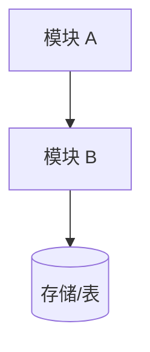

# Design Document · {{featureName}}

> 本模板为 Helmose 项目定制版（覆盖 `templates/design-template.md`）。
> 写作铁律：中文 + mermaid 架构图 + Code Reuse Analysis + 对齐 steering + 契约驱动。

## Overview

[2-3 段：这个设计把什么落地？分几条主线？核心设计原则是什么？]

**设计原则**
- **[原则 1]**：[为什么]。
- **[原则 2]**：[为什么]。
- **零 vault 侵入 / 最小 schema 改动 / 契约单一真相源**（按需引用）。

## Steering Document Alignment

### Technical Standards (tech.md)
- Rust edition 2021；模块经 `mod.rs` 暴露；跨模块 `crate::` 绝对路径。
- 命令 `#[tauri::command] fn ... -> Result<T, String>`，错误统一 `.map_err(|e| e.to_string())?`。
- IPC 返回 snake_case；前端 TS 接口对齐。
- indexer「纯解析不写库」——`parse_file` 返回结构体，写库在 `commands/` 层。

### Project Structure (structure.md)
- [新模块放哪、命名（snake_case Rust / PascalCase React 组件）。]
- [涉及 note_type/目录判定时复用 `services::contract`。]

## Code Reuse Analysis

### Existing Components to Leverage
- **[`模块::函数`（[文件.rs](../../../src-tauri/src/路径.rs)）]**：[它已提供什么，本设计如何复用/扩展，避免重写。]
- **[`models::X`（[文件.rs](../../../src-tauri/src/models/路径.rs)）]**：[现有 DTO 如何对齐/扩展。]

### Integration Points
- **Database/[表名] 表**：[如何连接现有 schema；是否需要 DDL（优先无 DDL）。]
- **`main.rs` invoke_handler**：[注册新命令。]
- **前端 [Page/Component]**：[如何接入新 IPC。]

## Architecture



[架构图下方一句关键说明：契约流向 / 数据流向 / 依赖方向。]

### Modular Design Principles
- **单一文件职责**：每个文件管一个领域。
- **组件隔离**：小而聚焦的组件，不做巨石文件。
- **服务层分离**：数据访问 / 业务逻辑 / 表现层分开。
- **契约集中**：note_type/目录/排除规则各有单一定义点（`contract/`、`utils/exclude.rs`）。

## Components and Interfaces

### Component 1：[模块名]（[文件路径]）
- **Purpose**：[做什么]。
- **Interfaces**：
  - `pub fn xxx(...) -> T` —— [签名 + 用途]。
  - `#[tauri::command] fn yyy(...) -> Result<T, String>` —— [IPC 命令]。
- **Dependencies**：[依赖什么]。
- **Reuses**：[复用哪些现有组件]。
- **开放决策**（如有）：[回应某个 Req 的开放问题，给出本 spec 采用的结论 + 理由]。

## Data Models

### [Model 名]（新增/修改 DTO）
```rust
#[derive(Debug, Clone, Serialize)]
pub struct XxxStats {
    pub field_a: String,   // snake_case，前端 TS 对齐
    pub field_b: usize,
}
```

> 涉及 IPC 的 DTO 必须 `#[derive(Serialize)]`，字段 snake_case（Rust serde 默认）。

### Database（如涉及）
- [表名/列名]：[改动；优先无 DDL，靠现有列/全量重建自然迁移。]

## Error Handling

1. **[场景 1]** → **Handling**: [处理] / **User Impact**: [用户看到什么]。
2. **[场景 2]** → **Handling**: [处理] / **User Impact**: [用户看到什么]。

> 关键：写 vault 前必须备份；契约无匹配降级不报错；目标非空拒绝写入。

## Testing Strategy

### Unit Testing
- [纯函数：覆盖核心逻辑 + 边界 + 降级。Helmose 风格用中文测试名，如 `空目录生成完整骨架()`。]

### Integration Testing
- [跨模块流程：命令 → service → 库 的链路验证。]

### End-to-End（现有 smoke test）
- [`index_real_wiki_smoke`：对 `~/wiki`（或 `HELMOSE_TEST_VAULT`）真实 1.9 万 md 跑解析，验证不崩 + 关键判定正确。]
